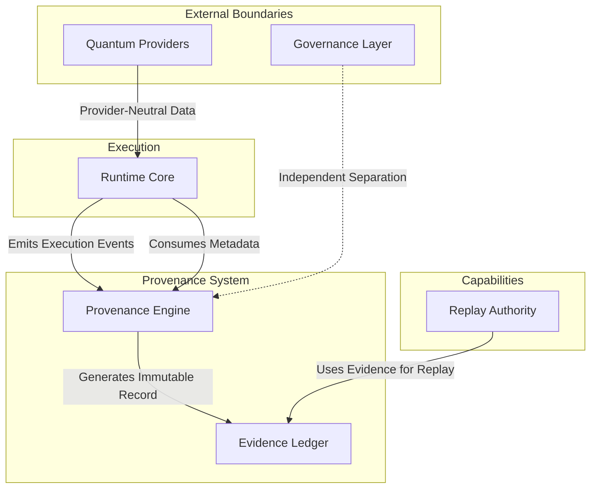

# Quantum Execution Provenance Doctrine

## 1. Architecture Document
The Quantum Execution Provenance architecture evolves the system from a pure replay-safe runtime into a deterministic execution infrastructure. It introduces a comprehensive execution evidence infrastructure that allows every hybrid quantum-classical computation to be independently reconstructed, verified, audited, and cryptographically proven.

Crucially, **Replay** is no longer the primary system abstraction. Instead, replay becomes one bounded capability within the broader execution provenance ecosystem. The runtime provides a deterministic trace without entangling governance or producer-specific logic into the core execution semantics.

## 2. Authority Boundaries

The system strictly adheres to the following authority boundaries:
- **Provenance Authority**: Owns the generation, storage, and cryptographic verification of execution evidence. It is the sole authority on *what* was executed and *how* it was proven.
- **Governance Layer**: Retains absolute authority over system governance, policies, and node behavior. **Execution evidence remains entirely separate from governance authority.**
- **Runtime Core**: Executes hybrid workloads and consumes provenance metadata. The Runtime Core **never** owns provenance authority or introduces autonomous execution decisions.
- **Replay Authority**: Relegated to a specialized capability that leverages provenance evidence to reproduce states, without dictating the entire execution lineage.

## 3. Interaction Diagram

## 4. Ownership Matrix

| Domain / Component | Ownership Responsibility | Provenance Authority | Governance Authority |
|--------------------|--------------------------|----------------------|----------------------|
| **Provenance System** | Generates, hashes, and stores execution evidence. | **Yes** | No |
| **Evidence Ledger** | Maintains the deterministic evidence chain. | **Yes** | No |
| **Runtime Core** | Executes quantum/classical workloads. | No | No |
| **Replay Authority** | Reconstructs executions from evidence. | No | No |
| **Governance Layer** | Enforces ecosystem rules and policies. | No | **Yes** |
| **Quantum Providers** | Hardware execution (IBM, IonQ, etc.). | No | No |
