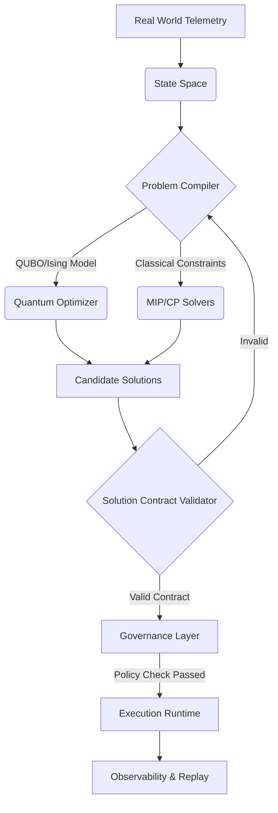

# Quantum Runtime Integration Blueprint

This document outlines how future quantum optimization systems attach to deterministic operational intelligence architectures (like BHIV). The goal is to isolate the probabilistic, heuristic nature of quantum computing from the deterministic governance and execution layers.

---

## Architectural Flow



---

## Separation of Concerns: Ownership

To maintain determinism and trust in critical operational systems, the Quantum layer is strictly a *compute coprocessor* for complex search, not an authoritative decision-maker.

### What the Quantum Layer OWNS:
1.  **Search & Optimization:** Navigating vast combinatorial landscapes to find global minima.
2.  **Candidate Generation:** Returning a primary solution and an ensemble of near-optimal alternatives.
3.  **Landscape Sampling:** Providing probabilities and energy states associated with different decisions.
4.  **Mathematical Translation:** Converting business logic (from the Problem Compiler) into physical Hamiltonian operations.

### What the Quantum Layer DOES NOT OWN:
1.  **Governance & Policy:** The quantum system does not know if a decision is legally or ethically permissible. It only minimizes an objective function. The Governance Layer ensures the solution complies with human rules.
2.  **Execution:** The quantum system does not trigger API calls, move physical assets, or dispatch personnel. It outputs data. The Execution Runtime handles state changes in the real world.
3.  **Trust Validation (Solution Contract):** Quantum hardware is noisy and probabilistic; it can return mathematically invalid answers (e.g., violating a hard constraint). A classical "Solution Contract Validator" must verify every quantum output against the original constraints before passing it downstream.
4.  **Replay Authority & Observability:** The quantum state collapses upon measurement. The deterministic system must log the *inputs* (QUBO matrix) and the *outputs* (the selected bitstring) to maintain an auditable, replayable history.
5.  **Capability Lifecycle:** The quantum layer does not define what a capability (e.g., a medical team) can do. It only reads the capability metadata to formulate constraints.

---

## The Contractual Interface

The bridge between the Quantum Optimizer and the deterministic system is the **Solution Contract**. 

When the Quantum Optimizer finishes, it yields a payload:
```json
{
  "problem_id": "req_881",
  "solver": "d-wave-advantage-system4.1",
  "energy": -1450.2,
  "bitstring": "100110...",
  "variable_mapping": {
    "teamA_zone1": 1,
    "teamA_zone2": 0
  }
}
```

The **Solution Contract Validator** takes this payload, translates it back into the operational domain, and runs a classical assertion check:
*   *Are all mandatory constraints satisfied?*
*   *Is the solution physically possible?*

Only if these checks pass is the solution forwarded to the **Governance Layer** for policy authorization and eventual execution.
